<style TYPE="text/css">
code.has-jax {font: inherit; font-size: 100%; background: inherit; border: inherit;}
</style>
<script type="text/x-mathjax-config">
MathJax.Hub.Config({
    tex2jax: {
        inlineMath: [['$','$'], ['\\(','\\)']],
        skipTags: ['script', 'noscript', 'style', 'textarea', 'pre'] // removed 'code' entry
    }
});
MathJax.Hub.Queue(function() {
    var all = MathJax.Hub.getAllJax(), i;
    for(i = 0; i < all.length; i += 1) {
        all[i].SourceElement().parentNode.className += ' has-jax';
    }
});
</script>
<script type="text/javascript" src="https://cdnjs.cloudflare.com/ajax/libs/mathjax/2.7.4/MathJax.js?config=TeX-AMS_HTML-full"></script>

# PipeTransformer: Automated Elastic Pipelining for Distributed Training of Large-scale Models

Authors: Chaoyang He (USC), Shen Li (Facebook), Mahdi Soltanolkotabi (USC), Salman Avestimehr (USC)

In this blogpost, we describe the first peer-reviewed research paper that explores accelerating the hybrid of PyTorch DDP (`torch.nn.parallel.DistributedDataParallel`) [1] and Pipeline (`torch.distributed.pipeline`) - [PipeTransformer: Automated Elastic Pipelining for Distributed Training of Large-scale Models](http://proceedings.mlr.press/v139/he21a.html) (Transformers such as BERT [2]  and ViT [3]), published at ICML 2021. 

PipeTransformer leverages automated elastic pipelining for efficient distributed training of Transformer models. In PipeTransformer, we design an adaptive on the fly freeze algorithm that can identify and freeze some layers gradually during training, and an elastic pipelining system that can dynamically allocate resources to train the remaining active layers. More specifically, PipeTransformer automatically excludes frozen layers from the pipeline, packs active layers into fewer GPUs, and forks more replicas to increase data-parallel width. We evaluate PipeTransformer using Vision Transformer (ViT) on ImageNet and BERT on SQuAD and GLUE datasets. Our results show that compared to the state-of-the-art baseline, PipeTransformer attains up to 2.83-fold speedup without losing accuracy. We also provide various performance analyses for a more comprehensive understanding of our algorithmic and system-wise design.

Next we will introduce the background, motivation, our idea, design, and how we implement the algorithm and system with PyTorch Distributed APIs. 

* Paper: [http://proceedings.mlr.press/v139/he21a.html](http://proceedings.mlr.press/v139/he21a.html)
* Source Code: [https://DistML.ai](https://distml.ai).
* Slides: [https://docs.google.com/presentation/d/1t6HWL33KIQo2as0nSHeBpXYtTBcy0nXCoLiKd0EashY/edit?usp=sharing](https://docs.google.com/presentation/d/1t6HWL33KIQo2as0nSHeBpXYtTBcy0nXCoLiKd0EashY/edit?usp=sharing)

# Introduction
<p align="center">
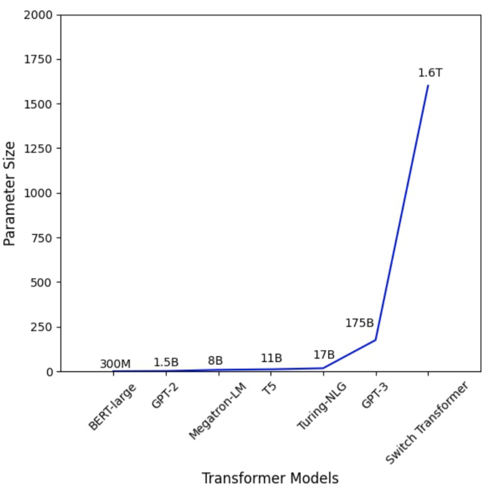
<br>
Figure 1: the Parameter Number of Transformer Models Increases Dramatically.
</p>


Large Transformer models [4][5] have powered accuracy breakthroughs in both natural language processing and computer vision. GPT-3 [4] hit a new record high accuracy for nearly all NLP tasks. Vision Transformer (ViT) [3] also achieved 89\% top-1 accuracy in ImageNet, outperforming state-of-the-art convolutional networks ResNet-152 and EfficientNet. To tackle the growth in model sizes, researchers have proposed various distributed training techniques, including parameter servers [6][7][8], pipeline parallel [9][10][11][12], intra-layer parallel [13][14][15], and zero redundancy data parallel [16].


Existing distributed training solutions, however, only study scenarios where all model weights are required to be optimized throughout the training (i.e., computation and communication overhead remains relatively static over different iterations). Recent works on <em>progressive training</em> suggest that parameters in neural networks can be trained dnamically:

* Freeze Training: Singular Vector Canonical Correlation Analysis for Deep Learning Dynamics and Interpretability. NeurIPS 2017
* Efficient Training of BERT by Progressively Stacking. ICML 2019
* Accelerating Training of Transformer-Based Language Models with Progressive Layer Dropping. NeurIPS 2020. Minjia Zhang
* On the Transformer Growth for Progressive BERT Training. NACCL 2021


<p align="center">
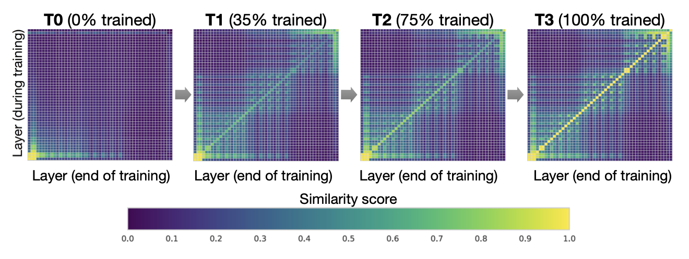
<br>
</p>
Figure 2. Interpretable Freeze Training: DNNs converge bottom up (Results on CIFAR10 using ResNet). Each pane shows layer-by-layer similarity using SVCCA [17][18]

For example, in freeze training [17][18], neural network usually converge from the bottom-up (i.e., not all layers need to be trained all the way through training). Figure 2 shows an example of how weights gradually stabilize during training in this approach. This observation motivates us to utilize freeze training for distributed training of Transformer models to accelerate training by dynamically allocating resources to focus on a shrinking set of active layers. Such a layer freezing strategy is especially pertinent to pipeline parallelism, as excluding consecutive bottom layers from the pipeline can reduce computation, memory, and communication overhead. 

<p align="center">
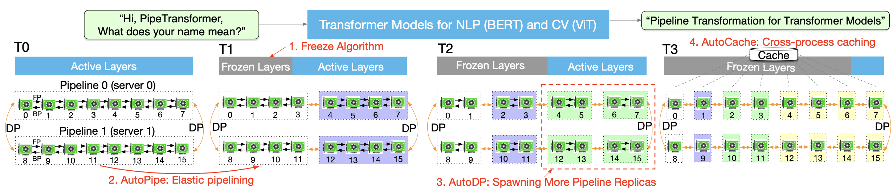
<br>
Figure 3. The process of PipeTransformer’s automated and elastic pipelining to accelerate distributed training of Transformer models
</p>


We propose PipeTransformer, an elastic pipelining training acceleration framework that automatically reacts to frozen layers by dynamically transforming the scope of the pipelined model and the number of pipeline replicas. To the best of our knowledge, this is the first paper that studies layer freezing in the context of both pipeline and data-parallel training. Figure 3 demonstrates the benefits of such a combation. First, by excluding frozen layers from the pipeline, the same model can be packed into fewer GPUs, leading to both fewer cross-GPU communications and smaller pipeline bubbles. Second, after packing the model into fewer GPUs, the same cluster can accommodate more pipeline replicas, increasing the width of data parallelism. More importantly, the speedups acquired from these two benefits are multiplicative rather than additive, further accelerating the training.

The design of PipeTransformer faces four major challenges. First, the freeze algorithm must make on the fly and adaptive freezing decisions; however, existing work [17][18] only provides a posterior analysis tool. Second, the efficiency of pipeline re-partitioning results is influenced by multiple factors, including partition granularity, cross-partition activation size, and the chunking (the number of micro-batches) in mini-batches, which require reasoning and searching in a large solution space. Third, to dynamically introduce additional pipeline replicas, PipeTransformer must overcome the static nature of collective communications and avoid potentially complex cross-process messaging protocols when onboarding new processes (one pipeline is handled by one process). Finally, caching can save time for repeated forward propagation of frozen layers, but it must be shared between existing pipelines and newly added ones, as the system cannot afford to create and warm up a dedicated cache for each replica.

<p align="center">
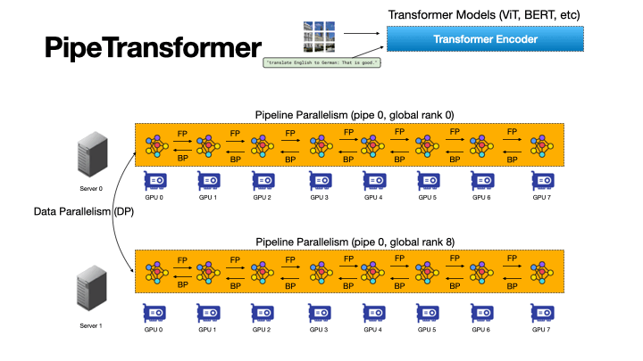
<br>
Figure 4: An Animation to Show the Dynamics of PipeTransformer
</p>

As show in the animation (Figure 4), PipeTransformer is designed with four core building blocks to address the aforementioned challenges. First, we design a tunable and adaptive algorithm to generate signals that guide the selection of layers to freeze over different iterations (Freeze Algorithm). Once triggered by these signals, our elastic pipelining module (AutoPipe), then packs the remaining active layers into fewer GPUs by taking both activation sizes and variances of workloads across heterogeneous partitions (frozen layers and active layers) into account. It then splits a mini-batch into an optimal number of micro-batches based on prior profiling results for different pipeline lengths. Our next module, AutoDP, spawns additional pipeline replicas to occupy freed-up GPUs and maintains hierarchical communication process groups to attain dynamic membership for collective communications. Our final module, AutoCache, efficiently shares activations across existing and new data-parallel processes and automatically replaces stale caches during transitions.


Overall, PipeTransformer combines the Freeze Algorithm, AutoPipe, AutoDP, and AutoCache modules to provide a significant training speedup.
We evaluate PipeTransformer using Vision Transformer (ViT) on ImageNet and BERT on GLUE and SQuAD datasets. Our results show that PipeTransformer attains up to 2.83-fold speedup without losing accuracy. We also provide various performance analyses for a more comprehensive understanding of our algorithmic and system-wise design.
Finally, we have also developed open-source flexible APIs for PipeTransformer, which offer a clean separation among the freeze algorithm, model definitions, and training accelerations, allowing for transferability to other algorithms that require similar freezing strategies. 

# Overall Design

Suppose we aim to train a massive model in a distributed training system where the hybrid of pipelined model parallelism and data parallelism is used to target scenarios where either the memory of a single GPU device cannot hold the model, or if loaded, the batch size is small enough to avoid running out of memory. More specifically, we define our settings as follows:

<strong>Training task and model definition.</strong> We train Transformer models (e.g., Vision Transformer, BERT on large-scale image or text datasets. The Transformer model $\mathcal{F}$ has $L$ layers, in which the $i$ th layer is composed of a forward computation function $f_i$ and a corresponding set of parameters. 

<strong>Training infrastructure.</strong> Assume the training infrastructure contains a GPU cluster that has $N$ GPU servers (i.e. nodes). Each node has $I$ GPUs. Our cluster is homogeneous, meaning that each GPU and server have the same hardware configuration. Each GPU's memory capacity is $M_\text{GPU}$. Servers are connected by a high bandwidth network interface such as InfiniBand interconnect.

<strong>Pipeline parallelism.</strong> In each machine, we load a model $\mathcal{F}$ into a pipeline $\mathcal{P}$ which has $K$ partitions ($K$ also represents the pipeline length). The $k$th partition $p_k$ consists of consecutive layers. We assume each partition is handled by a single GPU device. $1 \leq K \leq I$, meaning that we can build multiple pipelines for multiple model replicas in a single machine. We assume all GPU devices in a pipeline belong to the same machine. Our pipeline is a synchronous pipeline, which does not involve stale gradients, and the number of micro-batches is $M$. In the Linux OS, each pipeline is handled by a single process. We refer the reader to GPipe [10] for more details.

<strong>Data parallelism.</strong> DDP is a cross-machine distributed data parallel process group within $R$ parallel workers. Each worker is a pipeline replica (a single process). The $r$th worker's index (ID) is rank $r$. For any two pipelines in DDP, they can belong to either the same GPU server or different GPU servers, and they can exchange gradients with the AllReduce algorithm.

Under these settings, our goal is to accelerate training by leveraging freeze training, which does not require all layers to be trained throughout the duration of the training. Additionally, it may help save computation, communication, memory cost, and potentially prevent overfitting by consecutively freezing layers. However, these benefits can only be achieved by overcoming the four challenges of designing an adaptive freezing algorithm, dynamical pipeline re-partitioning, efficient resource reallocation, and cross-process caching, as discussed in the introduction.


<p align="center">
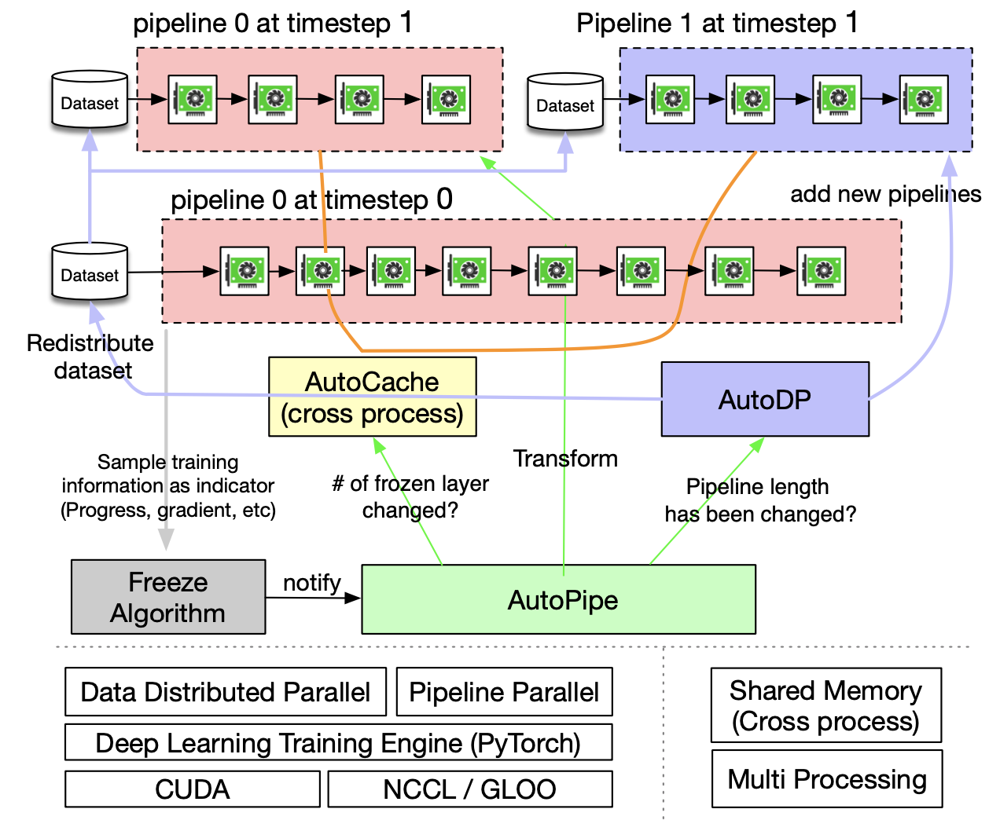
<br>
Figure 5. Overview of PipeTransformer Training System
</p>

PipeTransformer co-designs an on the fly freeze algorithm and an automated elastic pipelining training systemthat can dynamically transform the scope of the pipelinedmodel and the number of pipeline replicas. The overallsystem architecture is illustrated in Figure 5.  To support PipeTransformer’s elastic pipelining, we maintain acustomized version of PyTorch Pipeline. For data parallelism, we usePyTorch DDP as a baseline. Other libraries are standard mechanisms ofan operating system (e.g.,multi-processing) and thusavoid specialized software or hardware customization requirements. To ensure the generality of our framework, wehave decoupled the training system into four core compo-nents: <strong>freeze algorithm</strong>, <strong>AutoPipe</strong>, <strong>AutoDP</strong>, and <strong>AutoCache</strong>. The <strong>freeze algorithm</strong> (grey) samples indicators from the training loop and makes layer-wise freezingdecisions, which will be shared with <strong>AutoPipe</strong> (green). AutoPipeis an elastic pipeline module that speeds uptraining by excluding frozen layers from the pipeline andpacking the active layers into fewer GPUs (pink), leading toboth fewer cross-GPU communications and smaller pipelinebubbles. Subsequently, <strong>AutoPipe</strong> passes pipeline lengthinformation to <strong>AutoDP</strong> (purple), which then spawns morepipeline replicas to increase data-parallel width, if possible. The illustration also includes an example in which AutoDPintroduces a new replica (purple). <strong>AutoCache</strong> (orange edges) is a cross-pipeline caching module, as illustrated by connections between pipelines. The source code architecture is aligned with Figure 5 for readability and generality.

Next, we highlight how we use PyTorch Distributed APIs implement our research idea.


# Implementation Using PyTorch APIs

PipeTransformers contain four components: Freeze Algorithm, AutoPipe, AutoDP, and AutoCache. AutoPipe and AutoDP relies on PyTorch DDP (`torch.nn.parallel.DistributedDataParallel`) [1] and Pipeline (`torch.distributed.pipeline`), respectively. In this blog, we only highlight the key implmentation details of AutoPipe and AutoDP. For details of Freeze Algorithm and AutoCache, please refer to our paper.

## AutoPipe: Elastic Pipelining

AutoPipe can accelerate training by excluding frozen layers from the pipeline and packing the active layers into fewer GPUs. This section elaborates on the key components of AutoPipe that dynamically 1) partition pipelines, 2) minimize the number of pipeline devices, and 3) optimize mini-batch chunk size accordingly. 

### Basic Usage of PyTorch Pipeline
Before diving into details of AutoPipe, let us warm up the basic usage of PyTorch Pipeline (`torch.distributed.pipeline.sync.Pipe`, see [this tutorial](https://pytorch.org/docs/stable/pipeline.html)). More specially, we present a simple example to understand the design of Pipeline in practice:

```python
# Step 1: build a model including two linear layers
fc1 = nn.Linear(16, 8).cuda(0)
fc2 = nn.Linear(8, 4).cuda(1)

# Step 2: wrapper two layers with nn.Sequential
model = nn.Sequential(fc1, fc2)

# Step 3: build Pipe (torch.distributed.pipeline.sync.Pipe)
model = Pipe(model, chunks=8)

# do training/inference
input = torch.rand(16, 16).cuda(0)
output_rref = model(input)
```

In this basic example, we can see that before initiliazing `Pipe`, we need to partition the model `nn.Sequential` into multiple GPU devices and set optimal chunk number (`chunks`). Balancing computation time across partitions is critical to pipeline training speed, as skewed workload distributions across stages can lead to stragglers, forcing devices with lighter workloads to wait. The chunk number may also has non-trival influence to the throughput of pipeline.


### Balanced Pipeline Partitioning


In dynamic training system such as PipeTransformer, maintaining optimally balanced partitions in terms of paramter numbers does not guarantee the fastest training speed because other factors also play a crucial role:

<p align="center">
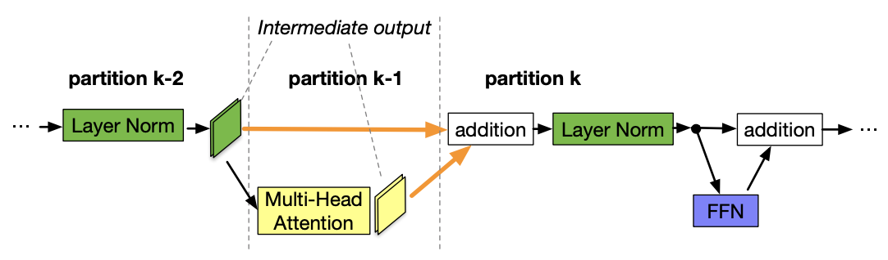
<br>
Figure 6. Overview of PipeTransformer Training System
</p>

1. Cross-partition communication overhead. Placing a partition boundary in the middle of a skip connection leads to additional communications since tensors in the skip connection must now be copied to a different GPU. Our measurements show that having cross-device communication is more expensive than having slightly imbalanced partitions. Therefore, we do not consider breaking skip connections.


### Pipeline Compression
<p align="center">
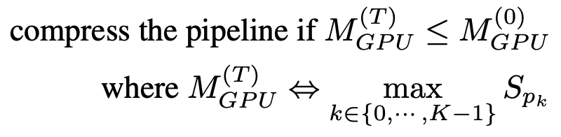
<br>
</p>

### Dynamic Number of Micro-Batches
<p align="center">
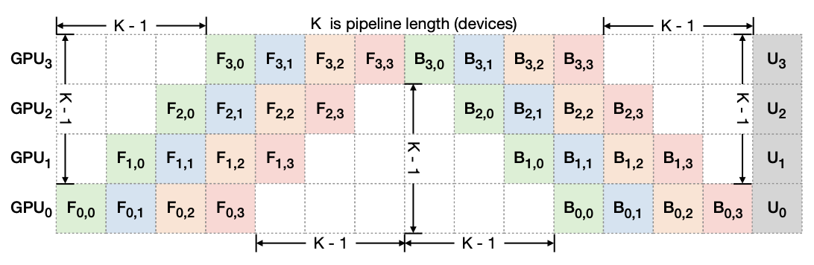
<br>
</p>

### Put All Together
<p align="center">
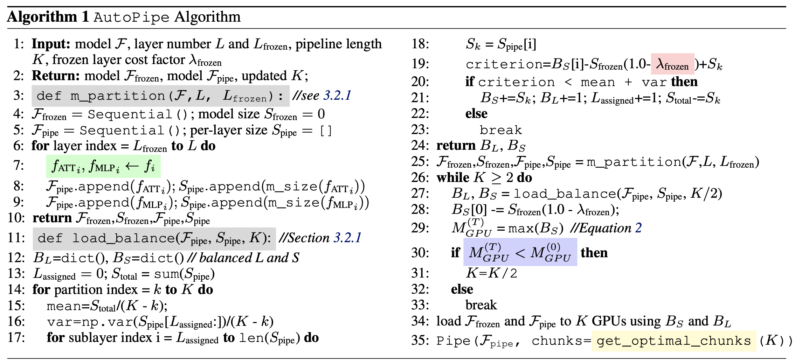
<br>
</p>


### AutoDP: Spawning More Pipeline Replicas
<p align="center">
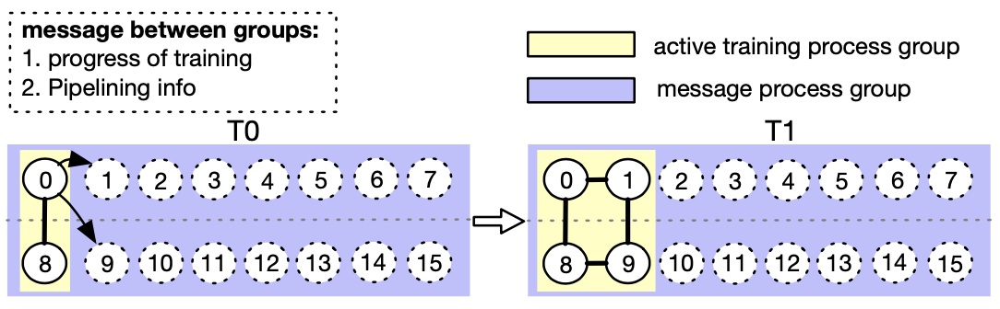
<br>
</p>


# Experiments
<p align="center">
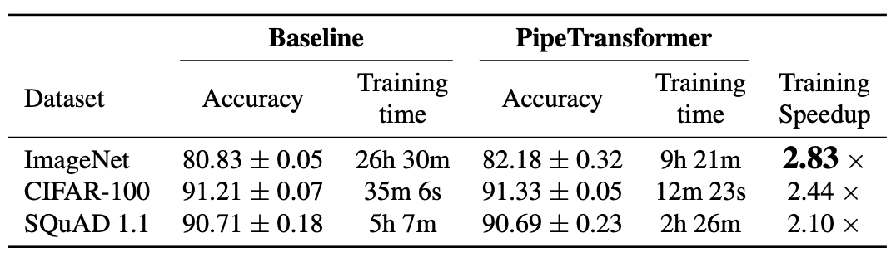
<br>
</p>

<p align="center">
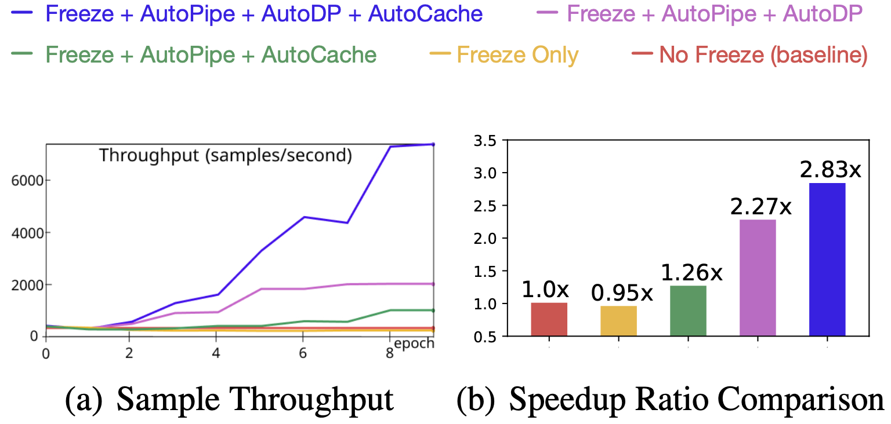
<br>
</p>

<p align="center">
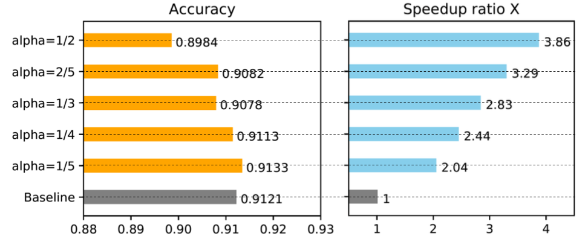
<br>
</p>

<p align="center">
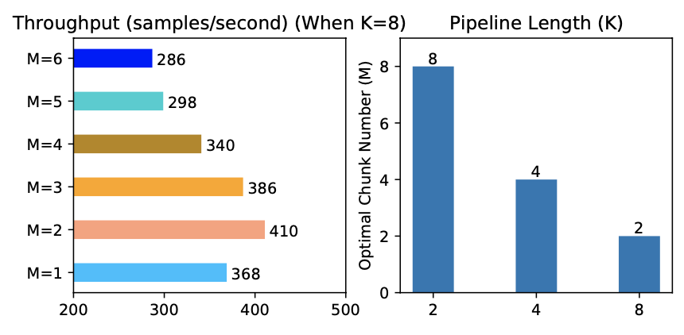
<br>
</p>

<p align="center">
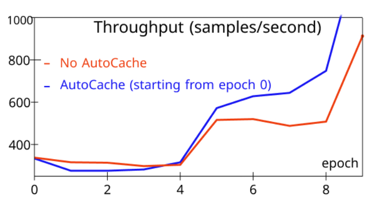
<br>
</p>

For more detailed experimental analysis, please refer to our paper.

# Summarization
This blog introduces PipeTransformer, a holistic solution that combines elastic pipeline-parallel and data-parallel for distributed training using PyTorch Distributed APIs. More specifically, PipeTransformer incrementally freezes layers in the pipeline, packs remaining active layers into fewer GPUs, and forks more pipeline replicas to increase the data-parallel width. Evaluations on ViT and BERT models show that compared to the state-of-the-art baseline, PipeTransformer attains up to 2.83× speedups without accuracy loss.


# Reference

[1] Li, S., Zhao, Y., Varma, R., Salpekar, O., Noordhuis, P., Li,T., Paszke, A., Smith, J., Vaughan, B., Damania, P., et al. Pytorch Distributed:  Experiences on Accelerating Dataparallel Training. Proceedings of the VLDB Endowment,13(12), 2020

[2] Devlin, J., Chang, M. W., Lee, K., and Toutanova, K. BERT: Pre-training of Deep Bidirectional Transformers for Language Understanding. In NAACL-HLT, 2019

[3] Dosovitskiy, A., Beyer, L., Kolesnikov, A., Weissenborn, D., Zhai, X., Unterthiner, T., Dehghani, M., Minderer, M., Heigold, G., Gelly, S., et al. An image is Worth 16x16 words: Transformers for Image Recognition at Scale.

[4] Brown, T. B., Mann, B., Ryder, N., Subbiah, M., Kaplan, J., Dhariwal, P., Neelakantan, A., Shyam, P., Sastry, G., Askell, A., et al. Language Models are Few-shot Learners.

[5] Lepikhin, D., Lee, H., Xu, Y., Chen, D., Firat, O., Huang, Y., Krikun, M., Shazeer, N., and Chen, Z. Gshard: Scaling Giant Models with Conditional Computation and Automatic Sharding.

[6] Li, M., Andersen, D. G., Park, J. W., Smola, A. J., Ahmed, A., Josifovski, V., Long, J., Shekita, E. J., and Su, B. Y. Scaling Distributed Machine Learning with the Parameter Server. In 11th {USENIX} Symposium on Operating Systems Design and Implementation ({OSDI} 14), pp. 583–598, 2014.

[7] Jiang, Y., Zhu, Y., Lan, C., Yi, B., Cui, Y., and Guo, C. A Unified Architecture for Accelerating Distributed DNN Training in Heterogeneous GPU/CPU Clusters. In 14th USENIX Symposium on Operating Systems Design and Implementation (OSDI 20), pp. 463–479. USENIX Association, November 2020. ISBN 978-1-939133-19- 9.

[8] Kim, S., Yu, G. I., Park, H., Cho, S., Jeong, E., Ha, H., Lee, S., Jeong, J. S., and Chun, B. G. Parallax: Sparsity-aware Data Parallel Training of Deep Neural Networks. In Proceedings of the Fourteenth EuroSys Conference 2019, pp. 1–15, 2019.

[9] Kim, C., Lee, H., Jeong, M., Baek, W., Yoon, B., Kim, I., Lim, S., and Kim, S. TorchGPipe: On-the-fly Pipeline Parallelism for Training Giant Models.

[10] Huang, Y., Cheng, Y., Bapna, A., Firat, O., Chen, M. X., Chen, D., Lee, H., Ngiam, J., Le, Q. V., Wu, Y., et al. Gpipe: Efficient Training of Giant Neural Networks using Pipeline Parallelism.

[11] Park, J. H., Yun, G., Yi, C. M., Nguyen, N. T., Lee, S., Choi, J., Noh, S. H., and ri Choi, Y. Hetpipe: Enabling Large DNN Training on (whimpy) Heterogeneous GPU Clusters through Integration of Pipelined Model Parallelism and Data Parallelism. In 2020 USENIX Annual Technical Conference (USENIX ATC 20), pp. 307–321. USENIX Association, July 2020. ISBN 978-1-939133- 14-4.

[12] Narayanan, D., Harlap, A., Phanishayee, A., Seshadri, V., Devanur, N. R., Ganger, G. R., Gibbons, P. B., and Zaharia, M. Pipedream: Generalized Pipeline Parallelism for DNN Training. In Proceedings of the 27th ACM Symposium on Operating Systems Principles, SOSP ’19, pp. 1–15, New York, NY, USA, 2019. Association for Computing Machinery. ISBN 9781450368735. doi: 10.1145/3341301.3359646.

[13] Lepikhin, D., Lee, H., Xu, Y., Chen, D., Firat, O., Huang, Y., Krikun, M., Shazeer, N., and Chen, Z. Gshard: Scaling Giant Models with Conditional Computation and Automatic Sharding. 

[14] Shazeer, N., Cheng, Y., Parmar, N., Tran, D., Vaswani, A., Koanantakool, P., Hawkins, P., Lee, H., Hong, M., Young, C., Sepassi, R., and Hechtman, B. Mesh-Tensorflow: Deep Learning for Supercomputers. In Bengio, S., Wallach, H., Larochelle, H., Grauman, K., Cesa-Bianchi, N., and Garnett, R. (eds.), Advances in Neural Information Processing Systems, volume 31, pp. 10414–10423. Curran Associates, Inc., 2018.

[15] Shoeybi, M., Patwary, M., Puri, R., LeGresley, P., Casper, J., and Catanzaro, B. Megatron-LM: Training Multi-billion Parameter Language Models using Model Parallelism.

[16] Rajbhandari, S., Rasley, J., Ruwase, O., and He, Y. ZERO: Memory Optimization towards Training a Trillion Parameter Models.

[17] Raghu, M., Gilmer, J., Yosinski, J., and Sohl Dickstein, J. Svcca: Singular Vector Canonical Correlation Analysis for Deep Learning Dynamics and Interpretability. In NIPS, 2017.

[18] Morcos, A., Raghu, M., and Bengio, S. Insights on Representational Similarity in Neural Networks with Canonical Correlation. In Bengio, S., Wallach, H., Larochelle, H., Grauman, K., Cesa-Bianchi, N., and Garnett, R. (eds.), Advances in Neural Information Processing Systems 31, pp. 5732–5741. Curran Associates, Inc., 2018.

